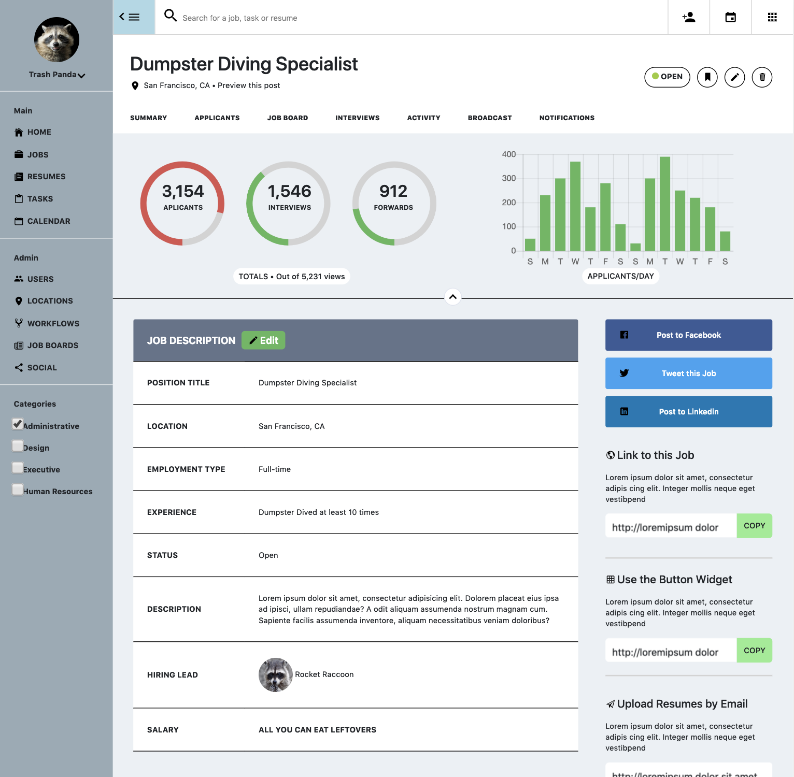
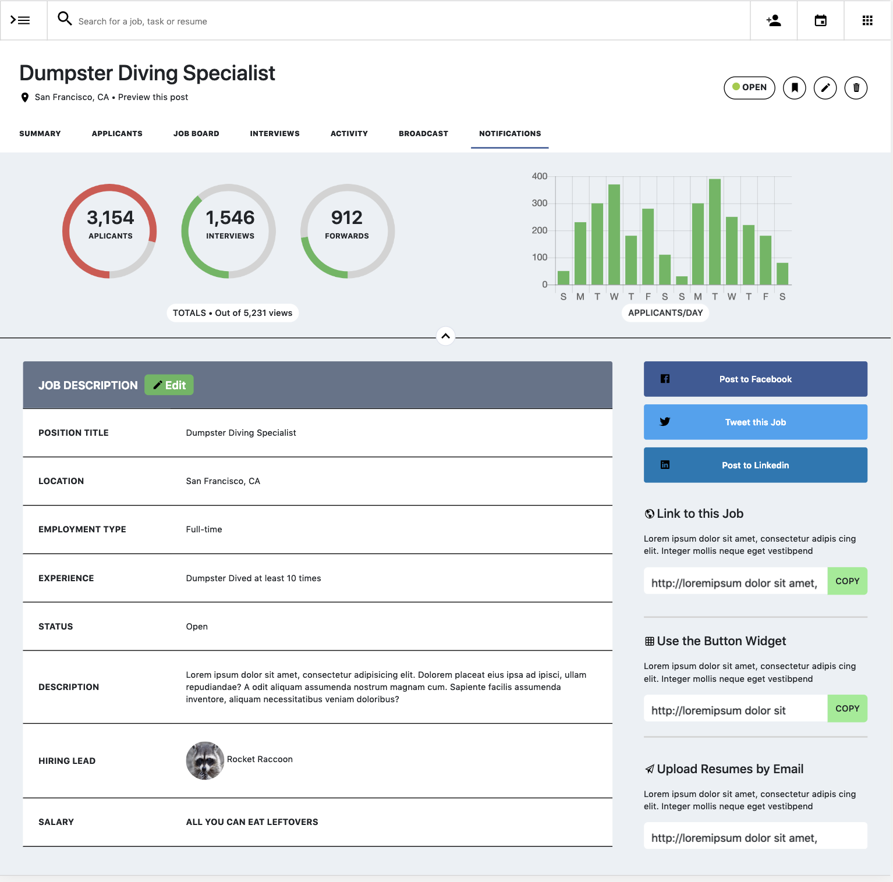

# Static Comp Challenge 2
Create a responsive page layout based on the comp provided. 

**Comp Provided**

**My Page & Responsive Layouts** 

  

**Goals**
1. Implement BEM/SMACSS guidelines
2. Add different hover state effects
3. Hide/Show side navbar using JS
4. Use Charting tools to create graphs
5. Add animations to elements

**Other tools used for this build**
1. Chart.js
